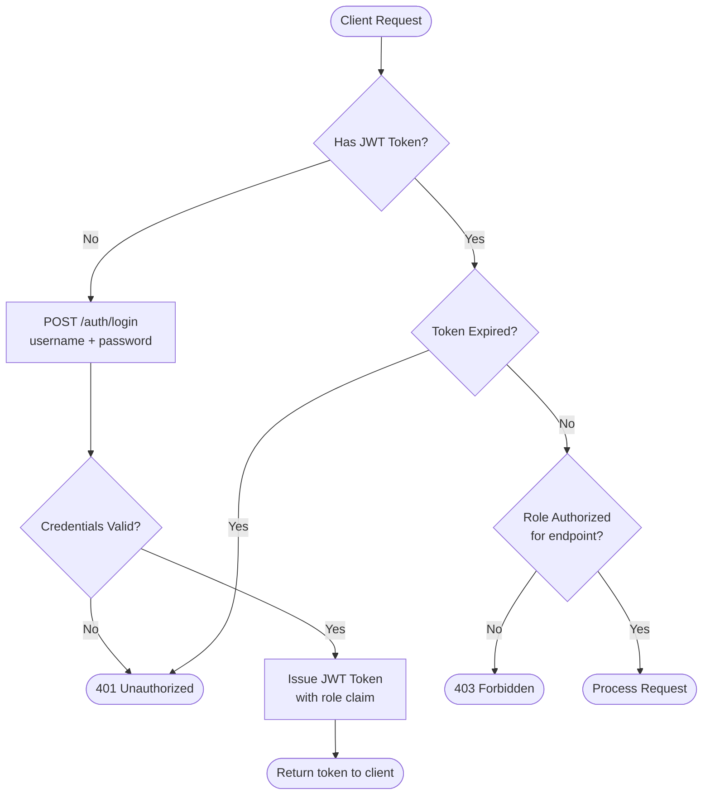
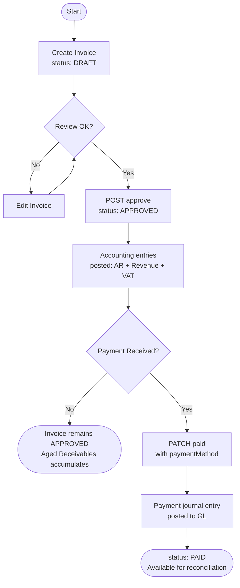
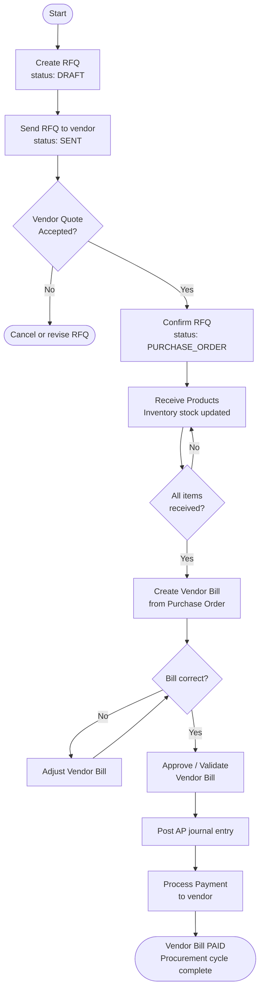
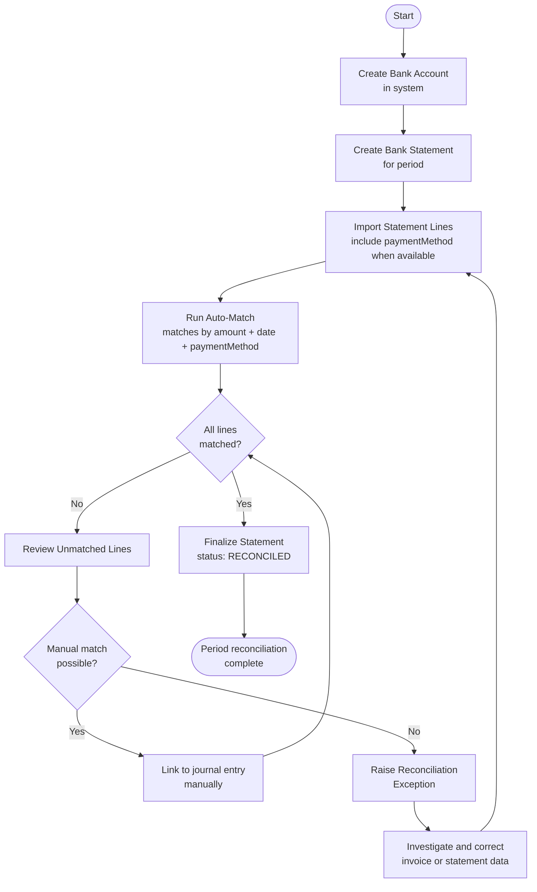
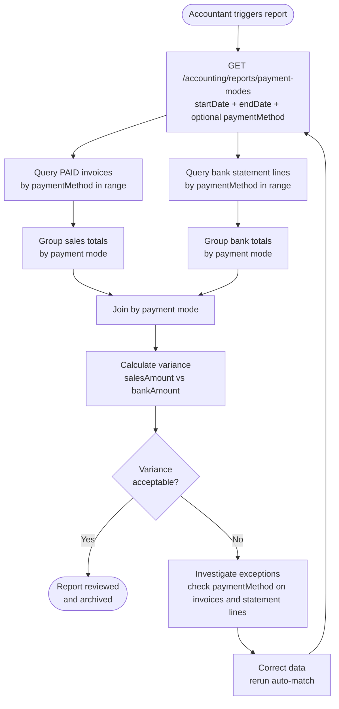
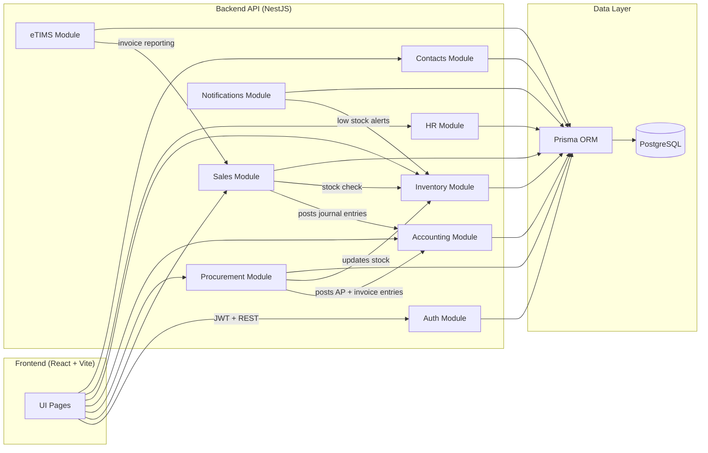
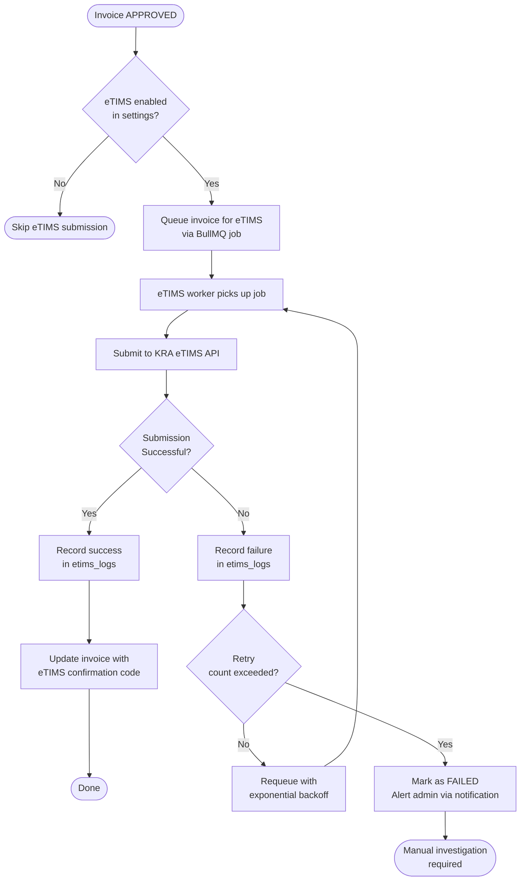

# ERP Backend Documentation

This repository contains the backend API for the ERP system built with NestJS, Prisma, and PostgreSQL.

## What This System Includes

The API powers the following modules:

1. Auth and Users
2. Sales and POS
3. Accounting
4. Inventory
5. Purchase (Procurement)
6. HR and Payroll
7. Contacts
8. eTIMS integration
9. Settings and Notifications

## Tech Stack

1. NestJS (TypeScript)
2. Prisma ORM
3. PostgreSQL
4. JWT authentication + role-based guards

## Quick Start

### 1) Install dependencies

```bash
npm install
```

### 2) Configure environment

Create/update your .env with database and JWT settings used by this project.

### 3) Run database migrations

```bash
npx prisma migrate deploy
```

### 4) Generate Prisma client

```bash
npx prisma generate
```

### 5) Start backend

```bash
# development
npm run start:dev

# production
npm run start:prod
```

Backend default base path used by frontend client:

```text
http://localhost:3000/api/v1
```

## Quality Checks

```bash
# Type check
npx tsc --noEmit

# Lint
npm run lint

# Unit tests
npm run test

# E2E tests
npm run test:e2e
```

## Authentication and Authorization

1. Login to get a JWT token.
2. Send token via Authorization header: Bearer <token>.
3. Access is protected by role guards on sensitive endpoints (for example accounting approval and reconciliation).

## How To Use the System (Operational Guide)

### Sales to Accounting flow

1. Create sales invoice in draft.
2. Approve invoice to post revenue/AR journal entries.
3. Mark as paid with a payment mode (CASH, CARD, MOBILE_MONEY, BANK_TRANSFER, CREDIT).
4. Payment posting creates accounting entries for reconciliation.

### Purchase flow

1. Create RFQ.
2. Send RFQ.
3. Confirm order to create Purchase Order.
4. Receive products.
5. Create vendor bill.
6. Validate/pay from accounting.

### Contacts flow

1. Create company and individual contacts.
2. Link individuals to company contacts.
3. Use contact records for operational and reporting context.

### Bank reconciliation flow

1. Create bank account.
2. Create bank statement.
3. Import statement lines.
4. Include paymentMethod on statement lines when available.
5. Run auto-match or manual match.
6. Finalize statement only when all lines are matched.

## Control Flow Diagrams

Visual reference for main system workflows. Diagrams use Mermaid syntax (rendered on GitHub and most modern markdown viewers).

### Authentication and Authorization Flow



---

### Sales Invoice Lifecycle



---

### Purchase and Procurement Lifecycle



---

### Bank Reconciliation Workflow



---

### Payment Mode Reporting Flow



---

### System Module Interaction Overview



---

### eTIMS Integration Flow



---

## Payment Mode Reporting and Reconciliation

The system supports reporting by payment mode and reconciling those modes with bank statements.

### Accounting report endpoint

```text
GET /accounting/reports/payment-modes
```

Query parameters:

1. startDate (required)
2. endDate (required)
3. paymentMethod (optional)

Example:

```text
/accounting/reports/payment-modes?startDate=2026-04-01&endDate=2026-04-30
```

Response includes:

1. Sales totals by payment method
2. Bank statement totals by payment method
3. Matched and unmatched reconciled amounts
4. Variance between sales and bank amounts

### Why this matters

1. Confirms whether payment channels reconcile to bank records.
2. Highlights missing or mismatched statement lines.
3. Supports daily and period-end financial control.

## Key API Areas

1. Auth: /auth/*
2. Sales: /sales/*
3. Accounting: /accounting/*
4. Inventory: /inventory/*
5. Procurement: /procurement/*
6. HR: /hr/*
7. Contacts: /contacts/*

## API Quick Reference

Use this index for the most common business operations.

| Endpoint | Purpose | Typical Role |
| --- | --- | --- |
| POST /auth/login | Sign in and obtain JWT token | All authenticated users |
| GET /sales/invoices | List invoices with filters | Admin, Sales User, Accountant |
| PATCH /sales/invoices/:id/approve | Approve invoice and post accounting entry | Admin, Accountant |
| PATCH /sales/invoices/:id/paid | Mark invoice as paid using payment method | Admin, Accountant |
| GET /sales/invoices/daily-summary | Daily summary including payment mode totals | Admin, Sales User, Accountant |
| GET /procurement/rfq | List RFQs and purchase flow state | Procurement Officer, Admin |
| POST /procurement/rfq/:id/confirm | Convert RFQ into purchase order | Procurement Officer, Admin |
| POST /procurement/purchase-orders/:id/create-bill | Create vendor bill from purchase order | Procurement Officer, Accountant |
| PATCH /procurement/vendor-bills/:id/approve | Validate vendor bill for accounting | Accountant, Admin |
| GET /contacts | Search and list contacts | Admin, Sales User, Procurement Officer |
| POST /accounting/bank-accounts/:id/statements | Create bank statement | Accountant, Admin |
| POST /accounting/bank-accounts/:id/statements/:stmtId/import | Import statement lines (with paymentMethod when available) | Accountant, Admin |
| POST /accounting/bank-accounts/:id/statements/:stmtId/auto-match | Auto-match statement lines to posted journal lines | Accountant, Admin |
| POST /accounting/bank-accounts/:id/statements/:stmtId/finalize | Finalize statement after full match | Accountant, Admin |
| GET /accounting/reports/payment-modes | Compare paid sales vs bank amounts by payment mode | Accountant, Admin |
| GET /accounting/reports/balance-sheet | Generate balance sheet report | Accountant, Admin |
| GET /accounting/reports/cash-flow | Generate cash flow report | Accountant, Admin |

## Troubleshooting

### Backend fails to start

1. Confirm PostgreSQL is running and credentials are correct.
2. Run migrations again.
3. Regenerate Prisma client.
4. Run typecheck and lint to catch compile issues.

### Reconciliation totals look wrong

1. Ensure statement lines include correct paymentMethod.
2. Confirm invoices were marked paid with the correct payment method.
3. Re-run auto-match after data correction.

## Notes for Developers

1. Keep database schema and migrations in sync.
2. Prefer explicit DTO updates when adding fields to finance-critical flows.
3. Run npx tsc --noEmit and npm run lint before committing changes.

## Role-Based User Manual

Use this section as the day-to-day operating guide for each team.

### Admin

1. Configure system settings and users.
2. Assign roles based on responsibilities.
3. Review cross-module dashboards and reconciliation exceptions.
4. Approve sensitive actions (account deactivation, critical voids, configuration changes).

### Accountant

1. Review posted invoices and vendor bills.
2. Validate and complete payments.
3. Create/import bank statements.
4. Run auto-match and resolve unmatched lines manually.
5. Finalize statement after all lines are matched.
6. Generate payment mode report and investigate variances.

### Sales User / Cashier

1. Create and approve invoices.
2. Capture payment method accurately at payment time.
3. Mark invoices paid only with the actual channel used.
4. Monitor daily summary by payment method.

### Procurement Officer

1. Create RFQ and send to vendor.
2. Confirm to purchase order.
3. Receive products.
4. Create vendor bill for accounting validation and payment.

### Inventory Manager

1. Maintain products, categories, warehouses.
2. Validate receiving and stock updates from purchases.
3. Reconcile stock movements with sales and procurement documents.

### HR Manager

1. Maintain employee records.
2. Process payroll and attendance flows.
3. Review leave and recruitment pipelines.

## Daily Operating Checklist

### Sales and Cash Controls (Daily)

1. Confirm all completed sales are approved.
2. Confirm all paid invoices have paymentMethod set.
3. Check daily summary totals by payment method.

### Banking and Reconciliation (Daily/Weekly)

1. Import latest bank statement lines.
2. Ensure payment method is captured on statement lines where possible.
3. Run auto-match.
4. Manually match unresolved lines.
5. Generate payment mode report for variance analysis.
6. Finalize statement only when unmatched lines are zero.

### Month-End Finance Checklist

1. Confirm no critical unreconciled bank lines remain.
2. Run payment mode report for full month.
3. Review aged receivables and aged payables.
4. Run balance sheet, cash flow, general ledger, VAT return.
5. Archive/export reports for audit support.

## Report Usage Examples

### Payment Mode Report

```text
GET /accounting/reports/payment-modes?startDate=2026-04-01&endDate=2026-04-30
```

Use when:

1. You need to compare paid sales vs bank statement totals by payment channel.
2. You need matched/unmatched amounts by mode.
3. You need to identify channel-specific variance quickly.

### Focus on a single mode

```text
GET /accounting/reports/payment-modes?startDate=2026-04-01&endDate=2026-04-30&paymentMethod=BANK_TRANSFER
```

## Data Entry Rules (Important)

1. Payment method on invoice payment must reflect the real channel used.
2. Payment method on bank statement line should be filled when source is known.
3. Avoid using generic or default values for finance-critical fields.
4. Corrections should be made before finalizing reconciliations.

## Error Codes and Common Fixes

Use this table when API calls fail during daily operations.

| Error / Message | Typical Cause | How to Fix |
| --- | --- | --- |
| 401 Unauthorized | Missing or expired JWT token | Re-login and send Authorization header with Bearer token |
| 403 Forbidden | User role lacks permission | Use an account with required role (Admin/Accountant/etc.) |
| 404 Not Found | Wrong record id or wrong endpoint | Confirm id exists and endpoint path is correct |
| 409 Conflict | Unique field already exists (invoiceNo, billNumber, contact email, etc.) | Use a unique value or review existing record before create |
| 422 Validation Failed | Missing required fields or invalid body payload | Check required fields and payload structure in request |
| Invoice is already APPROVED/PAID | Attempt to re-approve or re-pay non-draft invoice | Refresh record status and run only valid next action |
| Only APPROVED invoices can be marked as paid | Payment attempted on wrong status | Approve invoice first, then mark as paid |
| Insufficient stock for product | Sold quantity exceeds available stock | Reduce quantity or replenish stock before approval |
| Required accounts not found | Chart of accounts not seeded/configured | Create required GL accounts (AR, Revenue, VAT, Cash/Bank) |
| Statement is already reconciled | Editing/import attempted after finalization | Create a new statement period or reopen workflow policy |
| X lines are still unmatched. Reconcile all lines first. | Finalize attempted with unresolved matches | Run auto-match, then manual match remaining lines |
| Payment mode variance is high | Missing or incorrect paymentMethod mapping | Correct payment methods on invoice payments and statement lines, then rerun report and matching |

### Quick Debug Sequence

1. Re-check user role and token validity.
2. Re-check record status (draft/approved/paid/reconciled).
3. Re-check required accounting configuration (GL accounts, active bank account).
4. Re-check paymentMethod values on both invoice payment and statement line.
5. Re-run reconciliation and payment mode report after corrections.

## Pre-Go-Live Checklist

Run this checklist before moving to production.

### Environment and Security

1. Set production-grade JWT secret and expiry settings.
2. Confirm database credentials are production-only and not shared with dev.
3. Restrict CORS to approved frontend domains.
4. Disable debug-only settings and verbose logs.
5. Validate role assignments for Admin, Accountant, Sales, Procurement, HR.

### Database and Data Integrity

1. Apply all migrations with npx prisma migrate deploy.
2. Run npx prisma generate on deployment target.
3. Seed required master data (chart of accounts, tax setup, warehouse, users).
4. Confirm required finance accounts exist (AR, Revenue, VAT, Cash/Bank).
5. Verify backup and restore process with at least one test restore.

### Functional Validation

1. Sales flow: draft invoice -> approve -> paid with payment mode.
2. Purchase flow: RFQ -> confirm PO -> receive -> vendor bill -> payment.
3. Banking flow: statement import -> auto/manual match -> finalize.
4. Reporting: payment mode report, balance sheet, cash flow, VAT return.
5. Contacts: create company and individual, link and search records.

### Performance and Monitoring

1. Enable application and database monitoring.
2. Set alerts for API errors, database health, and failed jobs.
3. Confirm log retention and audit requirements.
4. Validate response time for key endpoints under expected load.

### Operational Readiness

1. Prepare user onboarding notes by role.
2. Prepare support runbook for common errors and quick fixes.
3. Define reconciliation cut-off times and month-end ownership.
4. Confirm rollback plan for failed deployment.

### Go-Live Sign-Off

1. Technical sign-off (backend/frontend/devops).
2. Finance sign-off (accounting and reconciliation).
3. Business sign-off (sales/procurement/hr leads).
4. Final go-live approval by system owner.

## Day-1 Go-Live Runbook

Use this schedule on launch day for controlled rollout.

### T-60 to T-30 minutes (Pre-Launch)

1. Confirm deployment artifacts are final and approved.
2. Verify production environment variables and secrets.
3. Ensure database backup completed and restore point documented.
4. Confirm monitoring dashboards and alert channels are active.

### T-30 to T-10 minutes (Readiness Gate)

1. Run health checks for API and database.
2. Confirm key users can authenticate (Admin, Accountant, Sales).
3. Validate critical endpoints return expected responses.
4. Freeze non-essential changes until post-launch stabilization.

### T0 (Go-Live)

1. Enable user access.
2. Announce go-live in support channel.
3. Start live command center tracking incidents and decisions.

### T+0 to T+60 minutes (Hypercare Phase 1)

1. Execute smoke tests:
	1. Create/approve/pay invoice.
	2. RFQ -> PO -> Vendor Bill flow.
	3. Bank statement import and auto-match.
	4. Payment mode report generation.
2. Monitor error rates, response times, and failed jobs.
3. Triage and classify any issue as blocker/high/normal.

### T+1 to T+4 hours (Hypercare Phase 2)

1. Validate first real business transactions per module.
2. Confirm accounting postings and balances are consistent.
3. Confirm reconciliation process remains functional with live data.
4. Publish hourly status updates to stakeholders.

### End-of-Day Close (Launch Day)

1. Review all incidents and open risks.
2. Confirm no critical unreconciled finance blockers.
3. Export initial operational reports for audit trail.
4. Record lessons learned and priority fixes for Day-2.

## Rollback Triggers and Actions

### Trigger rollback if any of the following occur

1. Sustained authentication failure for business users.
2. Data integrity issue in accounting postings.
3. Inability to reconcile statements due to systemic error.
4. Critical API failure with no hotfix path inside agreed window.

### Rollback actions

1. Disable user write operations.
2. Restore database to last validated backup point if required.
3. Revert application release to previous stable version.
4. Communicate incident status and ETA to stakeholders.

## Launch-Day Contacts Template

Capture this before go-live:

1. Incident Commander:
2. Backend Owner:
3. Frontend Owner:
4. DBA Owner:
5. Finance Owner:
6. Business Approver:
7. Communication Channel:

## Post-Go-Live Week-1 Checklist

Use this section to stabilize operations after launch.

### Daily Technical Health Checks

1. API error rate within agreed threshold.
2. Average and p95 response times for critical endpoints.
3. Background job success rates (eTIMS queues, notifications).
4. Database performance and connection pool health.

### Daily Finance Control Checks

1. Paid invoice totals reconcile to expected payment channels.
2. Bank statement import completeness for the day.
3. Auto-match success rate trend monitored.
4. Unmatched line backlog reviewed and actioned.
5. Payment mode variance reviewed and escalated if above threshold.

### Daily Operations Checks

1. Sales flow operational (create -> approve -> paid).
2. Purchase flow operational (RFQ -> PO -> receive -> vendor bill).
3. Contacts creation/search and role-based access functioning.
4. No blocker-level UI/API regressions reported by users.

## Week-1 KPI Targets (Suggested)

1. API uptime: >= 99.5%
2. Critical endpoint p95 response time: <= 1.5s
3. Payment mode report generation success: 100%
4. Bank statement auto-match rate: >= 80% (manual cleanup for remainder)
5. Unmatched lines older than 48 hours: 0 critical items

## Support SLA Guidance (Week-1)

1. P1 (business-stopping): acknowledge <= 15 min, workaround/fix <= 4 hours
2. P2 (major degradation): acknowledge <= 30 min, fix <= 1 business day
3. P3 (minor issue): acknowledge <= 4 hours, fix <= 3 business days
4. P4 (enhancement): triage in weekly planning

## Week-1 Exit Criteria

1. No unresolved P1 incidents.
2. Reconciliation process stable for at least 3 consecutive business days.
3. Finance sign-off on payment mode variance monitoring.
4. User support ticket volume trending down day-over-day.

## Appendix: Operational Templates

Use these templates as copy-paste starting points during support, finance review, and go-live operations.

### Incident Report Template

```text
Incident Title:
Date/Time Detected:
Detected By:
Severity: P1 / P2 / P3 / P4
Module Affected:
Environment: Production / Staging / Development

Summary:

Business Impact:

Technical Impact:

Steps to Reproduce:
1.
2.
3.

Observed Result:

Expected Result:

Immediate Workaround:

Owner:
Target Resolution Time:
Current Status:
Root Cause:
Corrective Action:
Preventive Action:
Sign-Off:
```

### Reconciliation Exception Template

```text
Exception ID:
Date Raised:
Raised By:
Bank Account:
Statement ID:
Payment Method:

Exception Type:
- Unmatched bank line
- Payment mode variance
- Incorrect payment method
- Missing statement line
- Duplicate entry

Reference Numbers:
- Invoice No:
- Journal Reference:
- Statement Line ID:

Amount:
Transaction Date:
Description:

Issue Summary:

Investigation Notes:

Proposed Resolution:

Approved By:
Resolution Date:
Final Outcome:
```

### Daily Finance Control Log Template

```text
Date:
Reviewed By:

1. Total Paid Invoices:
2. Total Bank Statement Lines Imported:
3. Auto-Matched Lines:
4. Manually Matched Lines:
5. Unmatched Lines Remaining:
6. Payment Mode Variance Identified:
7. Critical Exceptions Raised:
8. Statement Finalized: Yes / No

Notes:
```

### Change Approval Template

```text
Change Title:
Requested By:
Date Requested:
Environment:

Reason for Change:

Modules Affected:

Risk Level: Low / Medium / High

Pre-Checks Completed:
1.
2.
3.

Rollback Plan:

Approved By:
Scheduled Time:
Completion Status:
Post-Change Validation Result:
```
